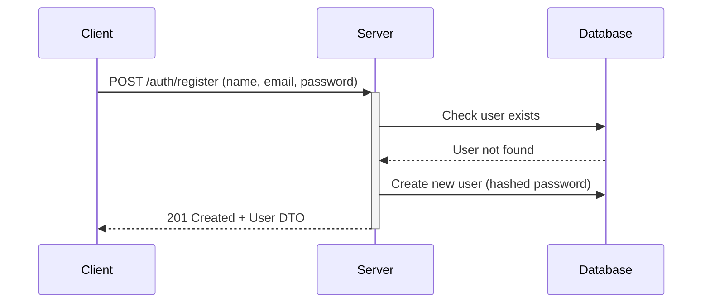
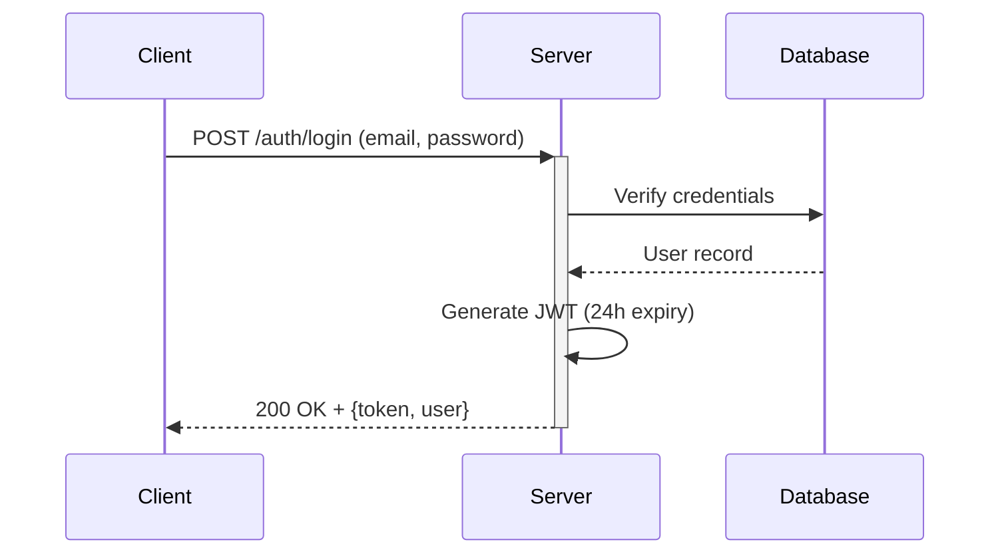
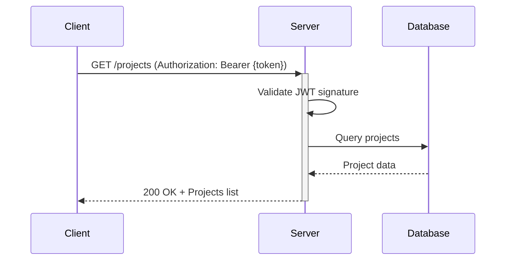

# Tracko - Collaborative Brainstorming Management Platform
Tracko is an innovative collaborative web application designed to streamline team-based project development from ideation to execution. The platform integrates artificial intelligence with intuitive collaboration tools to help teams:
1.  **AI-Assisted Ideation**
    -   Generate project ideas with Claude AI's intelligent suggestions
    -   Develop concepts through collaborative brainstorming sessions
    -   Refine ideas with AI-powered recommendation
        
2.  **Decision Making Tools**
    
    -   Conduct democratic voting on project directions
    -   Track decision history with timestamps and rationale
    -   Visualize consensus through real-time voting analytics
        
3.  **Team Communication**
    
    -   Sidebar live-chat for every project
    -   Real-time lobby on the project where users can see eachother's cursor

        
4.  **Progress Tracking**
    
    -   Report generation based on current state of the project
    -   Milestone tracking with progress indicators
    -   Activity feeds showing recent project changes
   

## Technologies

- **Backend**: Spring Boot
- **Database**: MongoDB
- **Authentication**: JWT Spring Security
- **AI Integration**: Claude
- **Build Tool**: Gradle

## Project Structure

The application follows a layered architecture:

```
- Controllers (UserController, ProjectController, etc.)
  - Services
    - Repositories
```
Each endpoint is managed by a dedicated controller, which delegates business logic to services and data access to repositories. All requests require an `Authorization` header with a valid JWT token.

### Authentication Flow

1.  **Registration**

    
2.  **Login**

    
4.  **Authenticated Request**

## Prerequisites
-   **Java 17 JDK**
    
-   **Gradle 7.6+**
    
-   **MongoDB 6.0+**
    
-   **Docker** (optional)

## Building with Gradle

You can use the local Gradle Wrapper to build the application.

- macOS/Linux: `./gradlew`
- Windows: `./gradlew.bat`

More information about [Gradle Wrapper](https://docs.gradle.org/current/userguide/gradle_wrapper.html) and [Gradle](https://gradle.org/docs/).

### Build

```bash
./gradlew build
```

### Run

```bash
./gradlew bootRun
```

You can verify that the server is running by visiting `localhost:8080` in your browser.

## Docker

Ensure that [Docker](https://www.docker.com/) is installed on your machine.

### Pull the image

```docker pull johndonneuzh/sopra-group-46-server```

### Run the container

```docker run -p 3000:3000 johndonneuzh/sopra-group-46-server```

## API Documentation

All API endpoints require an `Authorization` header with a valid JWT token. The server implements Spring Security for authentication and authorization.

### Authentication

| Endpoint       | Method | Parameters                     | Status | Response                     | Description                     |
|----------------|--------|--------------------------------|--------|------------------------------|---------------------------------|
| `/auth/login`  | POST   | username, password (Body)      | 200    | token, userID                | Verify credentials              |
| `/auth/register` | POST | name, username, email, password (Body) | 201 | User | Create new user |
| `/auth/logout` | POST   | token (Header)                 | 200    | -                            | Set user OFFLINE                |

### User Management

| Endpoint              | Method | Parameters                     | Status | Response                     | Description                     |
|-----------------------|--------|--------------------------------|--------|------------------------------|---------------------------------|
| `/users`             | GET    | -                             | 200    | List<User>                   | Fetch all users                 |
| `/users/{userID}`    | GET    | userID (Query)                | 200    | User                         | Fetch specific user             |
| `/users/{userID}`    | PUT    | token (Header), userID (Query), userUpdate (Body) | 202 | User | Update user |

### Project Management

| Endpoint                          | Method | Parameters                     | Status | Response                     | Description                     |
|-----------------------------------|--------|--------------------------------|--------|------------------------------|---------------------------------|
| `/projects`                      | POST   | token (Header), project (Body) | 201    | Project                      | Create project                  |
| `/projects/{projectID}`          | GET    | token (Header), projectID (Query) | 200 | Project | Get project |
| `/projects/{projectID}`          | PUT    | token (Header), projectID (Query), updates (Body) | 202 | Project | Modify project |
| `/projects/{projectID}`          | DELETE | token (Header), projectID (Query) | 204 | - | Delete project |
| `/projects/{projectID}/changes`  | GET    | token (Header), projectID (Query) | 200 | List<Change> | Get project changes |
| `/projects/{projectID}/messages` | POST   | token (Header), projectID (Query), message | 201 | - | Send message |
| `/projects/{projectID}/ideas`    | POST   | token (Header), idea (Body), projectID | 201 | Idea | Create idea |

### Idea Management

| Endpoint                                  | Method | Parameters                     | Status | Response                     | Description                     |
|-------------------------------------------|--------|--------------------------------|--------|------------------------------|---------------------------------|
| `/projects/{projectID}/ideas`            | GET    | token (Header), projectID      | 200    | List<Idea>                   | Get all ideas                   |
| `/projects/{projectID}/ideas/{ideaID}`   | GET    | token (Header), projectID, ideaID | 200 | Idea | Get specific idea |                               |
| `/projects/{projectID}/ideas/{ideaID}`   | PUT    | token (Header), updates (Body), ideaID, projectID | 200 | Idea | Modify idea |
| `/projects/{projectID}/ideas/{ideaID}`   | DELETE | token (Header), projectID, ideaID | 204 | - | Delete idea |

### Comments

| Endpoint                                              | Method | Parameters                     | Status | Response                     | Description                     |
|-------------------------------------------------------|--------|--------------------------------|--------|------------------------------|---------------------------------|
| `/projects/{projectID}/ideas/{ideaID}/comments`      | GET    | token (Header), ideaID, projectID | 200 | List<Comment> | Get all comments |
| `/projects/{projectID}/ideas/{ideaID}/comments`      | POST   | token (Header), comment (Body), projectID | 201 | Comment | Create comment |
| `/projects/{projectID}/ideas/{ideaID}/comments/{commentID}` | GET | token (Header), projectID, commentID | 200 | Comment | Get comment replies |
| `/projects/{projectID}/ideas/{ideaID}/comments/{commentID}` | POST | token (Header), comment (Body), projectID, commentID | 201 | Comment | Reply to comment |
| `/projects/{projectID}/ideas/{ideaID}/comments/{commentID}` | DELETE | token (Header), ideaID, projectID, commentID | 204 | - | Delete comment |

### Changes Endpoints

| Endpoint                                      | Method | Parameters                     | Status | Response                     | Description                     |
|-----------------------------------------------|--------|--------------------------------|--------|------------------------------|---------------------------------|
| `/projects/{projectID}/changes`              | GET    | token (Header), projectID      | 200    | List(Change)                 | Get all project changes         |
| `/projects/{projectID}/changes`              | POST   | token (Header), change (Body), projectID | 201 | Change | Commit a change |
| `/projects/{projectID}/changes/daily-contributions` | GET | token (Header), projectID | 200 | List(Change) | Get daily changes |
| `/projects/{projectID}/changes/contributions` | GET    | token (Header), projectID      | 200    | List(Change)                  | Get all contributions           |


## Authors and acknowledgment

-   [Matteo Adam](https://github.com/johndonneUZH)
-   [Miguel Vite](https://github.com/JMAVITE)
-   [Manuel Tuor](https://github.com/manueltuor)
-   [Ronald Domi](https://github.com/RonaldDomi)
-   [Fabio Di Meo](https://github.com/fabiotilor)

We thank [Youssef Farag](https://github.com/Figo2003) for his guidance and knowledge, as well as all teaching assistants of the module Software Engineering at the University of Zurich for their feedback and considerations on our project.

## License
This project is licensed under the Apache License 2.0 - see the [LICENSE](https://github.com/johndonneUZH/sopra-fs25-group-46-server/blob/main/LICENSE) file for details.


